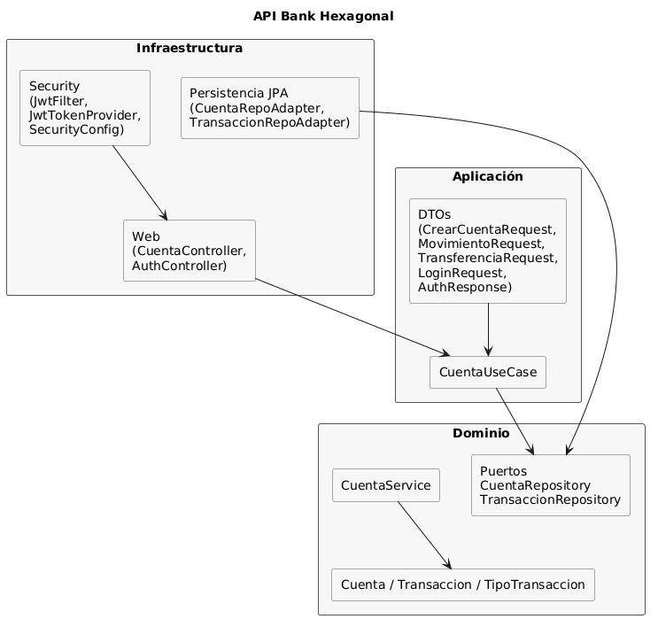

# Bank Hex (Spring Boot)

API bancaria basada en arquitectura hexagonal. Expone creación y gestión de cuentas, movimientos (depósitos, retiros), consultas de saldo e historial y transferencias. Seguridad con JWT y persistencia en H2 en memoria para desarrollo.

## Tecnologías
- Java 17, Maven
- Spring Boot 3 (Web, Security, Data JPA, Validation)
- H2 (memoria), MapStruct, Springdoc/OpenAPI (Swagger UI)
- JWT (jjwt)
- Tests: JUnit 5, Mockito, JaCoCo

## Arquitectura
- Dominio (`com.bank.domain`): entidad `Cuenta` y reglas de negocio.
- Aplicación (`com.bank.application`): casos de uso que coordinan operaciones bancarias y DTOs de entrada/salida.
- Infraestructura (`com.bank.infrastructure`):
  - `web`: controladores REST (`CuentaController`) y manejador global de errores.
  - `security`: `JwtTokenProvider` (crea/valida tokens HS256) y `JwtFilter` (inyecta autenticación en cada request).
  - `persistence`: adaptadores/repositorios y mapeo de entidades.
  - `config`: `SecurityConfig` y otros beans.
- Diagrama: [Arquitectura hexagonal](#diagrama-de-arquitectura-mermaid)
- Imagen: 


## Endpoints principales
- `POST /cuenta` crear cuenta.
- `GET /cuenta/{numero}` obtener datos.
- `GET /cuenta/{numero}/saldo` consultar saldo.
- `POST /cuenta/{numero}/deposito` depositar.
- `POST /cuenta/{numero}/retiro` retirar.
- `GET /cuenta/{numero}/historial` movimientos.
- `POST /cuenta/transferencia` transferir.

Swagger UI: `http://localhost:9090/swagger-ui.html`  
Consola H2: `http://localhost:9090/h2-console` (user `sa`, sin password; JDBC `jdbc:h2:mem:bankdb`; tablas principales: `CUENTA`, `TRANSACCION`).

## Seguridad (JWT)
- Rutas abiertas definidas en `SecurityConfig` (`/auth/**`, Swagger, H2 console). El resto requiere `Authorization: Bearer <token>`.
- `JwtTokenProvider` firma tokens HS256 y valida firma/expiración; `JwtFilter` los lee y coloca el usuario en el `SecurityContext`.
- Inicio de sesión: `POST /auth/login` con JSON `{"username":"admin","password":"password"}` (usuarios demo: `admin/password`, `user/password`). Respuesta: `{"token": "...", "username": "...", "role": "...", "expiresAt": ...}`.
- Uso del token: copia el valor de `token` y envíalo en el header `Authorization: Bearer <token>` en todas las llamadas protegidas. En Swagger, pulsa “Authorize” y pega `Bearer <token>`.

## Configuración
`src/main/resources/application.yml`:
- Puerto: `9090`
- Datasource: `jdbc:h2:mem:bankdb`, `ddl-auto: update`, `show-sql: true`
- Consola H2 habilitada en `/h2-console`

## Ejecución
Requisitos: Java 17 y Maven.
```bash
mvn spring-boot:run
# o
mvn clean package && java -jar target/bank-hex-1.0.0.jar
```

## Pruebas y cobertura
```bash
mvn test          # Ejecuta tests
mvn verify        # Genera reporte JaCoCo: target/site/jacoco/index.html
```
Incluye pruebas para casos de uso, controladores, seguridad (provider y filtro JWT), mappers y adaptadores de persistencia.
Para ver el reporte abre en el navegador `target/site/jacoco/index.html` (en Windows puedes ejecutar `start target/site/jacoco/index.html`, en macOS `open ...`).

## Consola H2 (conexión)
- URL: `http://localhost:9090/h2-console`
- Driver: `org.h2.Driver`
- JDBC URL (runtime): `jdbc:h2:mem:bankdb`
- Usuario: `sa`
- Password: _(vacío)_
- Tablas principales: `CUENTA`, `TRANSACCION`
- Nota: base en memoria, existe mientras la app esté corriendo. En tests se usa `jdbc:h2:mem:bankhexdb`.
Para ver la cobertura JaCoCo, abre `target/site/jacoco/index.html` en el navegador después de `mvn verify`.

## Estructura
```
src/main/java/com/bank
  ├─ BankHexApplication.java       # arranque Spring Boot
  ├─ domain/                       # entidades y reglas
  ├─ application/                  # casos de uso y DTOs
  └─ infrastructure/
       ├─ web/                     # REST + excepciones
       ├─ security/                # JWT provider + filtro
       ├─ config/                  # beans y seguridad
       └─ persistence/             # adaptadores/repositorios
```

### Estructura detallada (archivos clave)
- `BankHexApplication.java`: clase main, inicializa Spring Boot.
- `domain/model/Cuenta.java`: entidad de dominio con número, saldo y movimientos; operaciones de negocio.
- `domain/model/Transaccion.java`, `TipoTransaccion.java`: modelo de movimiento y tipo (DEPÓSITO/RETIRO/TRANSFERENCIA).
- `domain/service/CuentaService.java`: lógica de negocio sobre cuentas.
- `domain/repository/CuentaRepository.java`, `TransaccionRepository.java`: puertos de dominio.
- `domain/event/TransaccionCreadaEvent.java`, `TransaccionEventListener.java`: evento de dominio y listener.
- `domain/exception/CuentaNoEncontradaException.java`, `SaldoInsuficienteException.java`: excepciones de negocio.
- `application/dto/*.java`: DTOs de entrada/salida (crear cuenta, movimientos, transferencias, respuestas).
- `application/mapper/CuentaMapper.java`, `TransaccionMapper.java`: MapStruct para mapear dominio ⇆ DTO/entidad.
- `application/usecase/CuentaUseCase.java`: orquestación de casos de uso bancarios.
- `infrastructure/web/CuentaController.java`: endpoints REST de cuenta y transferencias.
- `infrastructure/web/AuthController.java`: endpoint de autenticación (si se usa para emitir JWT).
- `infrastructure/web/GlobalExceptionHandler.java`: traduce excepciones a respuestas HTTP.
- `infrastructure/security/JwtTokenProvider.java`: genera/valida JWT (HS256) y extrae usuario.
- `infrastructure/security/JwtFilter.java`: filtra cada request, lee `Authorization: Bearer`, valida y autentica.
- `infrastructure/security/InMemoryAuthService.java`: autenticación en memoria (usuarios demo) usada por `AuthController`.
- `infrastructure/config/SecurityConfig.java`: define `SecurityFilterChain`, rutas públicas y filtro JWT.
- `infrastructure/config/OpenApiConfig.java`: configuración de Swagger/OpenAPI.
- `infrastructure/config/AppConfig.java`: otros beans de infraestructura.
- `infrastructure/persistence/entity/CuentaEntity.java`, `TransaccionEntity.java`: entidades JPA.
- `infrastructure/persistence/jpa/CuentaJpaRepository.java`, `TransaccionJpaRepository.java`: repositorios Spring Data.
- `infrastructure/persistence/adapter/CuentaRepositoryAdapter.java`, `TransaccionRepositoryAdapter.java`: adaptan repos JPA a puertos de dominio.
- `src/main/resources/application.yml`: propiedades de entorno (puerto, H2, JPA, consola H2).
- `src/test/java/...`: suite de pruebas (casos de uso, controladores, seguridad, mappers, adaptadores).

## Notas
- H2 en memoria: los datos se pierden al reiniciar.
- Si agregas login, ubícalo bajo `/auth/**` o ajusta `SecurityConfig`.
